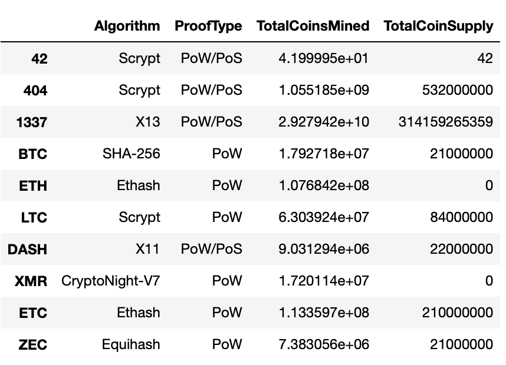
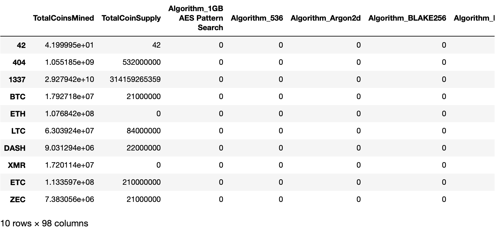
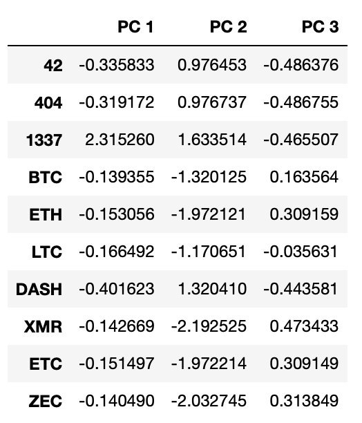
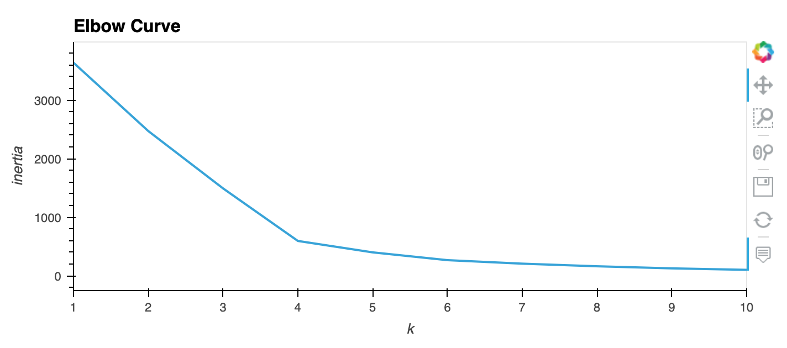
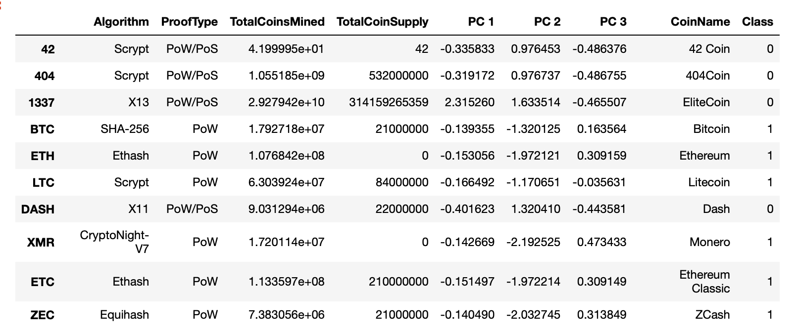
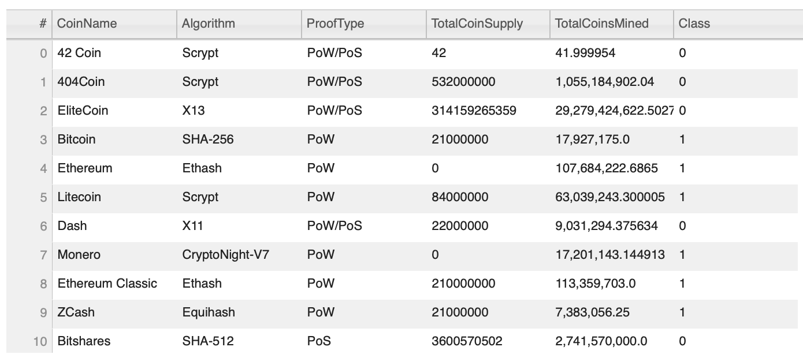
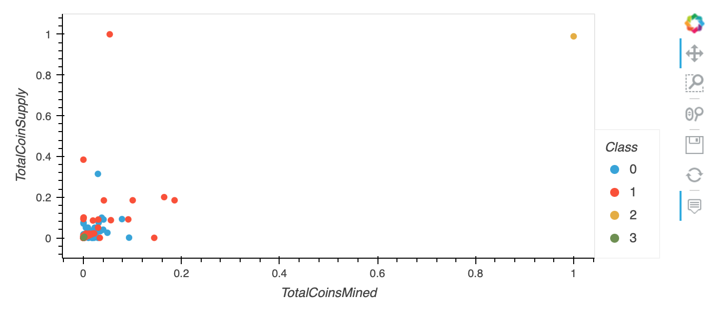

# Cryptocurrencies

## Overview of Project

The purpose of this project is to use machine learning to determine which cryptocurrencies exist on the trading market and how they could be grouped to build a classification system for development of a new investment. Furthermore, unsupervised machine learning is used because there is no known output and the data that we will be working with has to be processed before grouping the cryptocurrencies together using the clustering algorithm. As a result of this, the following steps has to be performed for preparing an analysis for clients who are looking forward to get into the cryptocurrency market:

- Preprocessing the Data for PCA.
- Reducing the Data for PCA.
- Clustering Cryptocurrencies using K-means.
- Visualizing Cryptocurrencies Results.

## Results

This section of the project focuses on the results achieved after processing the data to fit the unsupervised machine learning model.

### Preprocessing the Data for PCA 

In this part of the project, the data on the cryptocurrencies that was retrieved as a CSV file from [CryptoCompare](https://min-api.cryptocompare.com/data/all/coinlist) was preprocessed by performing the following:

- Keeping the cryptocurrencies that were being traded.
- Dropping the **IsTrading** column.
- Removing the rows that have at least one null value.
- Keeping the coins that have been mined.

Figure below illustrates the **crypto_df** after performing the aforementioned preprocessing steps.

Additionally, the text features of the data were transformed into indicator variables using the **get_dummies()** method as depicted in the figure below.

### Reducing Data Dimensions using PCA

In this section of the project, Principal Component Analysis (PCA) algorithm, was performed for reducing the number of dimensions to only three principal components to prevent overfitting the data as demonstrated in the figure below.

### Clustering Cryptocurrencies using K-means

In this section of the project, knowledge of K-means algorithm was used for creating an elbow curve using **hvplot** for finding the best K value as illustrated in the plot below.

Looking at the elbow curve , the k value of 3 was selected since that is the point where the vertical direction shifts to a strong horizontal direction. Hence, the KMeans algorithm was then initialized for making predictions of the K-clusters for the cryptocurrencies' data and a new DataFrame was created as illustrated in the figure below.

### Visualizing Cryptocurrencies Results

In this part of the project Plotly Express and **hvplot** was used for visualizing the distinct groups that corresponded to the three principal components created earlier. Additionally, a table showing the tradable cryptocurrencies was created using **hvplot.table()** as shown in the figure below.

 The scatter plot is illustrated in the figure below.

## Summary

In conclusion, cryptocurrencies were grouped together using KMeans clustering algorithm after fitting the preprocessed data into the unsupervised machine learning model. Hence, by this way we were able to create an analysis for the clients who were looking forward to get into the cryptocurrency market.

